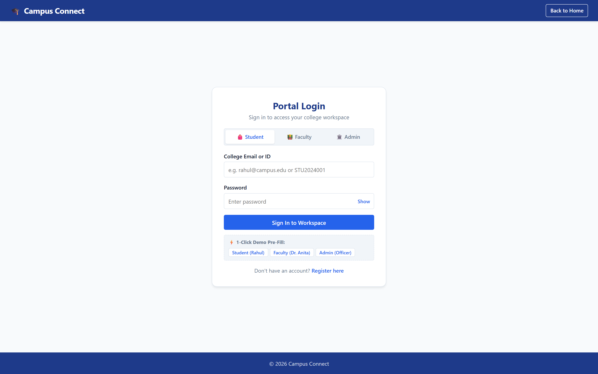
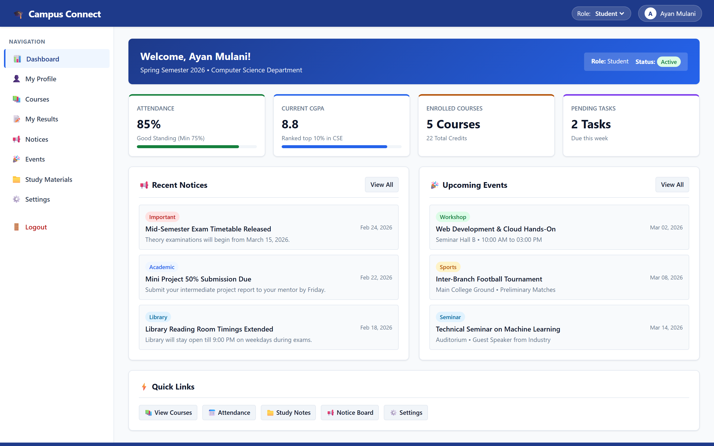
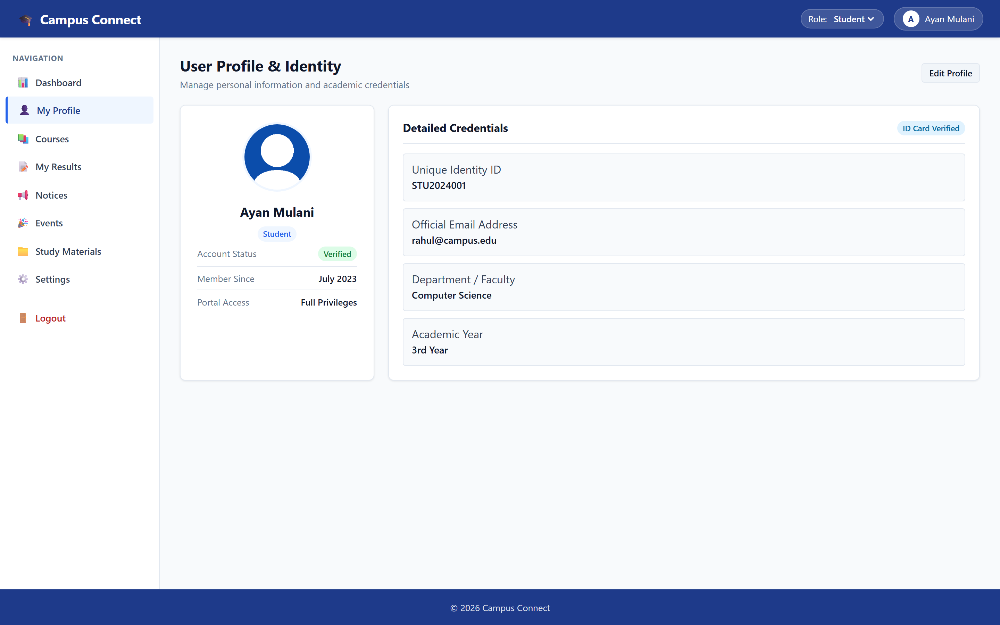
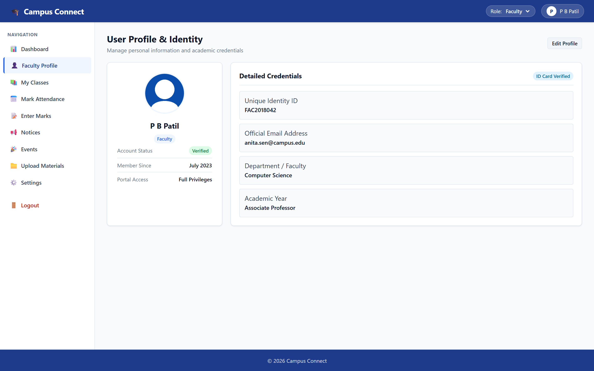
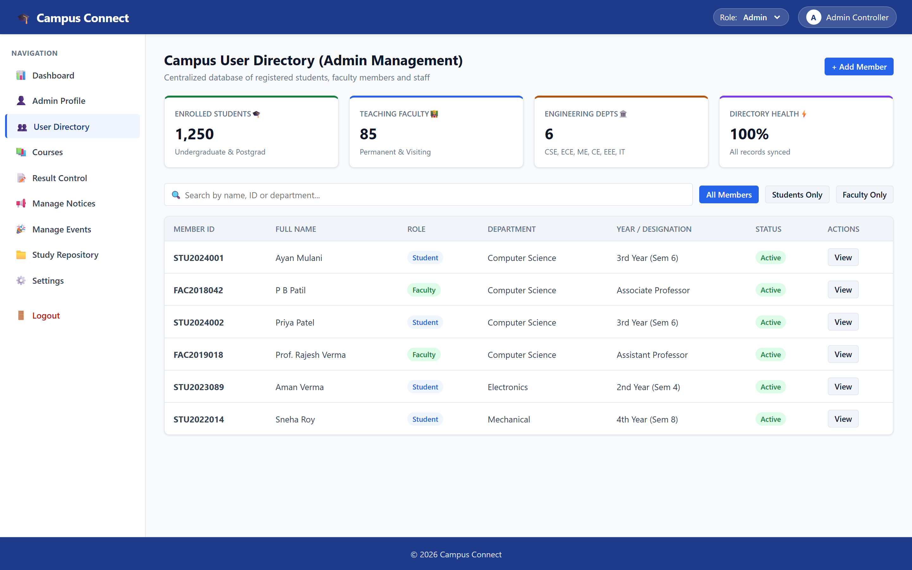
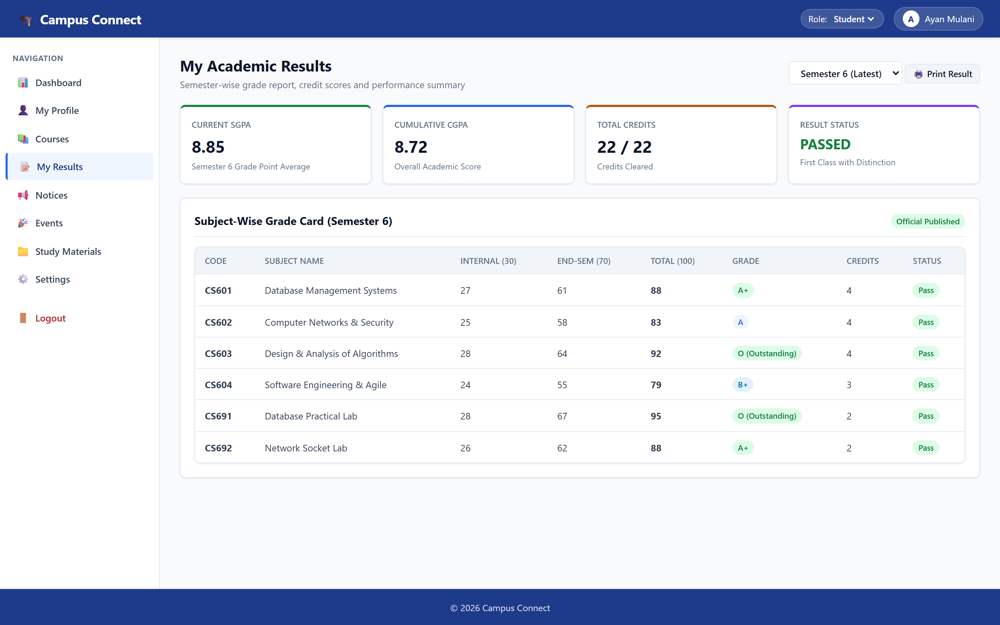

# Campus Connect

A web-based campus ERP and college management portal built to bring everyday academic services into one clean, accessible platform for students, faculty members, and college administrators.

---

## 📌 About the Project

In our college, academic tasks like checking attendance, viewing course syllabus, accessing lecture notes, checking exam results, and reading circulars often happen across scattered channels. I started building **Campus Connect** as my college mini-project to bring these core features into a unified web portal.

The project currently focuses on the complete frontend architecture and interactive user workflows. It includes dedicated interfaces and dashboards for three main roles: **Student**, **Faculty**, and **Administrator**.

> **Project Status: 🚧 In Development — Approximately 50% Complete**  
> The frontend UI and client-side interactions are implemented. Backend APIs and database integration are planned for the next development phase.

---

## 🎯 Current Implemented Features

Here are the modules and features implemented in this 50% milestone:

- **Role-Based Portals**: Separate dashboards and navigation for Students, Faculty, and Admin.
- **Authentication & Quick Demo**: Login and registration forms with 1-click pre-fill demo buttons for testing all three roles.
- **Student Dashboard**: Live cards showing overall attendance percentage, SGPA/CGPA, enrolled courses, and recent campus notices.
- **Attendance System**: Subject-wise attendance breakdown with shortage indicators, plus an interactive faculty roll-call toggle (Present / Absent / Late).
- **Academic Results & Grading**:
  - *Student View*: Semester grade card with subject breakdown and distinction status.
  - *Faculty View*: Student marks entry sheet with grade assignments and saving simulation.
  - *Admin View*: Departmental result status with publish/unpublish controls.
- **Course Catalog**: Curriculum list showing course codes, assigned professors, credit weightage, and syllabus completion meters.
- **Notice Board**: Categorized announcement feed (Examinations, Academic, Events) with search filter and a post-notice modal.
- **Study Materials Repository**: Downloadable lecture notes, lab manuals, and previous year papers categorized by subject.
- **Events Section**: Campus activity listings with date badges and RSVP toggles.
- **User Directory (Admin)**: Member directory with search and category filtering across students and teaching faculty.
- **Profile Management**: Profile identity card with editable contact and department information.

---

## 🛠️ Tech Stack

- **HTML5**: Semantic layout and markup
- **CSS3**: Custom responsive styling, flexbox/grid layouts, and theme variables (no heavy external CSS frameworks)
- **Vanilla JavaScript**: Role management, client-side session handling via `localStorage`, dynamic sidebar navigation, and search/filter logic

---

## ⚡ Demo Login Credentials

You can test all three roles directly on the login page using the quick 1-click pre-fill buttons or the following credentials:

| Role | Email / ID | Password |
| :--- | :--- | :--- |
| **Student** | `rahul@campus.edu` | `123456` |
| **Faculty** | `anita.sen@campus.edu` | `123456` |
| **Admin** | `admin@campus.edu` | `123456` |

---

## 📸 Screenshots

Here are actual screenshots taken from the running project:

### 1. Login Portal (With Demo Role Switcher)


### 2. Student Dashboard


### 3. Student Profile (Ayan Mulani)


### 4. Faculty Profile (P B Patil)


### 5. Admin User Directory


### 6. Academic Results & Grade Card


---

## 🚀 How to Run Locally

1. Clone this repository:
   ```bash
   git clone https://github.com/ayanmulani4867-cyber/Campus-Connect-50-.git
   ```
2. Navigate to the project directory:
   ```bash
   cd Campus-Connect-50-
   ```
3. Open `index.html` directly in any web browser (Chrome, Edge, Firefox), or use a lightweight local server like VS Code Live Server / Python HTTP server:
   ```bash
   # Optional: run with Python
   python -m http.server 3000
   ```
4. Sign in using the demo buttons on the login screen to explore the different role views.

---

## 📝 Roadmap for Future Milestones

- [ ] Connect with a backend server (Node.js / Express or Python backend)
- [ ] Database integration (MongoDB or PostgreSQL) for persistent user accounts and records
- [ ] Secure JWT authentication and password hashing
- [ ] Real file uploads for study material PDFs
- [ ] Real-time push notifications for new circulars and announcements
